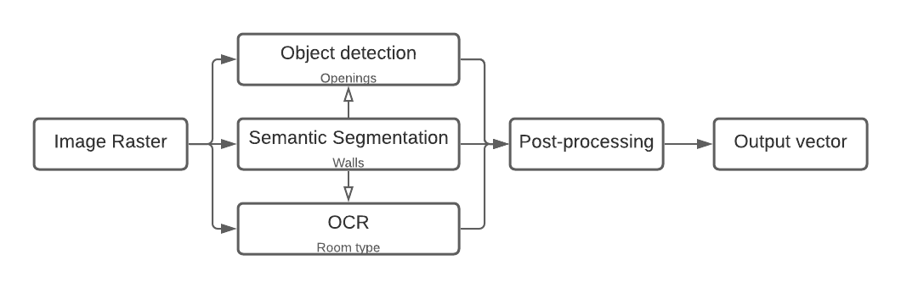

# Deep Floor Plan Reconstruction using the CubiCasa5K Data Set

Using this for my masters thesis at the University of Twente. The goal is to obtain the following information: wall, opening (window or door), room (including room type), and the front door.




### Contents 

* src / 
    * dataset (input files) 
    * models (TF/Keras Models)
    * readers (data readers)
    * main.py

### Requirements and conda environment
```
conda env create -f environment.yml
source activate deeplearning_floorplan
```

### Load data 

The dataset [Kalervo et al., 2019](https://arxiv.org/abs/1904.01920) is used as training data. The original [GitHub repo](https://github.com/CubiCasa/CubiCasa5k) is a PyTorch implementation.

```
cd input
wget -O input/cubicasa5k.zip https://zenodo.org/record/2613548/files/cubicasa5k.zip?download=1
! unzip -qq cubicasa5k.zip #-qq for quiet
```


### GPU installation 

[Tensorflow GPU Guide](https://www.tensorflow.org/install/gpu), or just run on [Google Colab](https://colab.research.google.com)